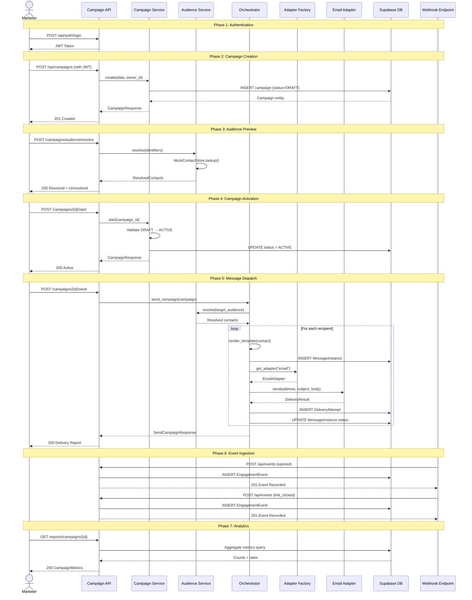

# 📋 API Contract Documentation

## Marketing Campaign Management Portal

> REST API specification with request/response schemas, status codes,
> and interaction sequence diagrams.

---

## Base URL

| Environment | URL |
|-------------|-----|
| Local Development | `http://localhost:8000` |
| Vercel Production | `https://your-project.vercel.app` |

**Common Headers:**
```
Authorization: Bearer <JWT_TOKEN>
Content-Type: application/json
```

---

## Endpoints Overview

| Method | Endpoint | Auth Required | Description |
|--------|----------|:---:|-------------|
| `POST` | `/api/auth/login` | ❌ | Authenticate and get JWT |
| `GET` | `/api/auth/me` | ✅ | Get current user profile |
| `POST` | `/api/campaigns` | ✅ | Create a campaign |
| `GET` | `/api/campaigns` | ✅ | List all campaigns |
| `GET` | `/api/campaigns/{id}` | ✅ | Get campaign details |
| `PUT` | `/api/campaigns/{id}` | ✅ | Update a campaign |
| `DELETE` | `/api/campaigns/{id}` | ✅ | Delete a campaign |
| `POST` | `/api/campaigns/{id}/start` | ✅ | Start campaign (DRAFT → ACTIVE) |
| `POST` | `/api/campaigns/{id}/pause` | ✅ | Pause campaign (ACTIVE → PAUSED) |
| `POST` | `/api/campaigns/{id}/resume` | ✅ | Resume campaign (PAUSED → ACTIVE) |
| `POST` | `/api/campaigns/{id}/stop` | ✅ | Stop campaign permanently |
| `POST` | `/api/campaigns/{id}/send` | ✅ | Trigger message dispatch |
| `POST` | `/api/campaigns/audience/resolve` | ✅ | Resolve audience identifiers |
| `POST` | `/api/events` | ❌ | Ingest engagement event (webhook) |
| `GET` | `/api/reports/campaigns/{id}` | ✅ | Get campaign metrics |
| `GET` | `/api/health` | ❌ | Health check |

---

## 1. Authentication

### POST `/api/auth/login`

Authenticate and receive a JWT access token.

**Request Body:**
```json
{
  "email": "admin@campaignportal.io",
  "password": "any-password"
}
```

**Response `200 OK`:**
```json
{
  "access_token": "eyJhbGciOiJIUzI1NiIs...",
  "token_type": "bearer",
  "expires_in": 3600,
  "user": {
    "id": "usr_01HQXK3M7N8P9R0S1T2U3V4W5X",
    "email": "admin@campaignportal.io",
    "full_name": "Portal Administrator",
    "role": "admin"
  }
}
```

**Response `401 Unauthorized`:**
```json
{
  "detail": "Invalid email or password"
}
```

### GET `/api/auth/me`

**Response `200 OK`:**
```json
{
  "id": "usr_01HQXK3M7N8P9R0S1T2U3V4W5X",
  "email": "admin@campaignportal.io",
  "full_name": "Authenticated User",
  "role": "admin"
}
```

---

## 2. Campaign Management

### POST `/api/campaigns`

Create a new campaign in DRAFT status.

**Request Body:**
```json
{
  "name": "Summer Sale 2025",
  "description": "Promote summer discounts to all subscribers",
  "channel": "email",
  "message_template": "Hi {{first_name}}, check out our summer deals! 🌞 Visit https://shop.example.com",
  "target_audience": "alice@example.com,bob_builder,+1-555-0103",
  "schedule_time": "2025-07-01T09:00:00Z"
}
```

**Response `201 Created`:**
```json
{
  "id": "550e8400-e29b-41d4-a716-446655440000",
  "name": "Summer Sale 2025",
  "description": "Promote summer discounts to all subscribers",
  "channel": "email",
  "message_template": "Hi {{first_name}}, check out our summer deals! 🌞 Visit https://shop.example.com",
  "target_audience": "alice@example.com,bob_builder,+1-555-0103",
  "schedule_time": "2025-07-01T09:00:00Z",
  "status": "draft",
  "owner_id": "usr_01HQXK3M7N8P9R0S1T2U3V4W5X",
  "created_at": "2025-05-15T10:30:00Z",
  "updated_at": "2025-05-15T10:30:00Z"
}
```

### GET `/api/campaigns`

**Query Parameters:**
| Param | Type | Default | Description |
|-------|------|---------|-------------|
| `status` | string | null | Filter: `draft`, `active`, `paused`, etc. |
| `limit` | int | 50 | Max results (1-100) |
| `offset` | int | 0 | Pagination offset |

**Response `200 OK`:**
```json
{
  "campaigns": [
    { "id": "...", "name": "...", "status": "draft", "..." : "..." }
  ],
  "total": 42
}
```

### PUT `/api/campaigns/{id}`

Update campaign (DRAFT status only).

**Request Body:**
```json
{
  "name": "Updated Campaign Name",
  "message_template": "New template: Hi {{first_name}}!"
}
```

### POST `/api/campaigns/{id}/send`

Trigger message delivery.

**Request Body:**
```json
{
  "recipient_identifiers": ["alice@example.com", "bob_builder", "+1-555-0103"]
}
```

**Response `200 OK`:**
```json
{
  "campaign_id": "550e8400-...",
  "total_recipients": 3,
  "total_sent": 3,
  "total_delivered": 2,
  "total_failed": 1,
  "messages": [
    {
      "message_id": "msg-uuid-1",
      "contact_id": "contact_01_alice",
      "recipient_address": "alice@example.com",
      "status": "delivered",
      "provider_message_id": "ses-abc123",
      "latency_ms": 142,
      "error": null
    },
    {
      "message_id": "msg-uuid-2",
      "contact_id": "contact_02_bob",
      "recipient_address": "bob@example.com",
      "status": "delivered",
      "provider_message_id": "ses-def456",
      "latency_ms": 198,
      "error": null
    },
    {
      "message_id": "msg-uuid-3",
      "contact_id": "contact_03_charlie",
      "recipient_address": "charlie@example.com",
      "status": "failed",
      "provider_message_id": "ses-ghi789",
      "latency_ms": 87,
      "error": "Mailbox full"
    }
  ]
}
```

### POST `/api/campaigns/audience/resolve`

Preview audience resolution without sending.

**Request Body:**
```json
{
  "identifiers": ["alice@example.com", "bob_builder", "unknown@nowhere.com"]
}
```

**Response `200 OK`:**
```json
{
  "resolved": [
    {
      "id": "contact_01_alice",
      "identifier": "alice@example.com",
      "email": "alice@example.com",
      "phone": "+1-555-0101",
      "username": "alice_wonder",
      "first_name": "Alice",
      "last_name": "Wonderland",
      "resolved": true
    },
    {
      "id": "contact_02_bob",
      "identifier": "bob_builder",
      "email": "bob@example.com",
      "phone": "+1-555-0102",
      "username": "bob_builder",
      "first_name": "Bob",
      "last_name": "Builder",
      "resolved": true
    }
  ],
  "unresolved": ["unknown@nowhere.com"],
  "total_resolved": 2,
  "total_unresolved": 1
}
```

---

## 3. Engagement Events

### POST `/api/events`

Webhook endpoint for engagement event ingestion. **No authentication required** (validate webhook signatures in production).

**Request Body:**
```json
{
  "message_id": "msg-uuid-1",
  "event_type": "link_clicked",
  "event_details": {
    "link_url": "https://shop.example.com/summer",
    "user_agent": "Mozilla/5.0 (iPhone; CPU iPhone OS 17_0)"
  },
  "source_ip": "203.0.113.42",
  "user_agent": "Mozilla/5.0 (iPhone; CPU iPhone OS 17_0)"
}
```

**Supported `event_type` values:**
`delivered` | `opened` | `read` | `replied` | `link_clicked` | `page_navigated` | `button_clicked`

**Response `201 Created`:**
```json
{
  "id": "evt-uuid-1",
  "message_id": "msg-uuid-1",
  "event_type": "link_clicked",
  "event_details": {
    "link_url": "https://shop.example.com/summer",
    "user_agent": "Mozilla/5.0 (iPhone; CPU iPhone OS 17_0)"
  },
  "source_ip": "203.0.113.42",
  "user_agent": "Mozilla/5.0 (iPhone; CPU iPhone OS 17_0)",
  "created_at": "2025-05-15T11:45:00Z"
}
```

---

## 4. Reporting

### GET `/api/reports/campaigns/{campaign_id}`

**Response `200 OK`:**
```json
{
  "campaign_id": "550e8400-...",
  "campaign_name": "Summer Sale 2025",
  "total_recipients": 100,
  "total_sent": 100,
  "total_delivered": 87,
  "total_failed": 13,
  "total_opened": 52,
  "total_replied": 8,
  "total_clicked": 23,
  "delivery_rate": 87.0,
  "open_rate": 59.77,
  "click_rate": 44.23
}
```

---

## 5. Error Responses

All errors follow a consistent structure:

```json
{
  "error": {
    "code": "ENTITY_NOT_FOUND",
    "message": "Campaign with id 'xyz' not found",
    "correlation_id": "a1b2c3d4-e5f6-7890-abcd-ef1234567890"
  }
}
```

**Error Codes:**
| Code | HTTP Status | Description |
|------|-------------|-------------|
| `ENTITY_NOT_FOUND` | 404 | Requested resource doesn't exist |
| `INVALID_STATE_TRANSITION` | 409 | Invalid campaign lifecycle transition |
| `AUDIENCE_RESOLUTION_FAILED` | 422 | Could not resolve audience identifiers |
| `CHANNEL_NOT_SUPPORTED` | 400 | Unsupported delivery channel |
| `VALIDATION_ERROR` | 422 | Request body validation failure |
| `INTERNAL_SERVER_ERROR` | 500 | Unhandled server error |

---

## 6. Sequence Diagram: Full Campaign Lifecycle


