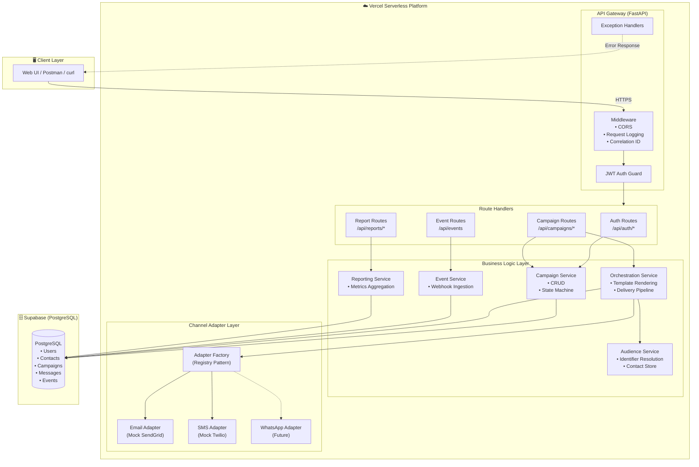
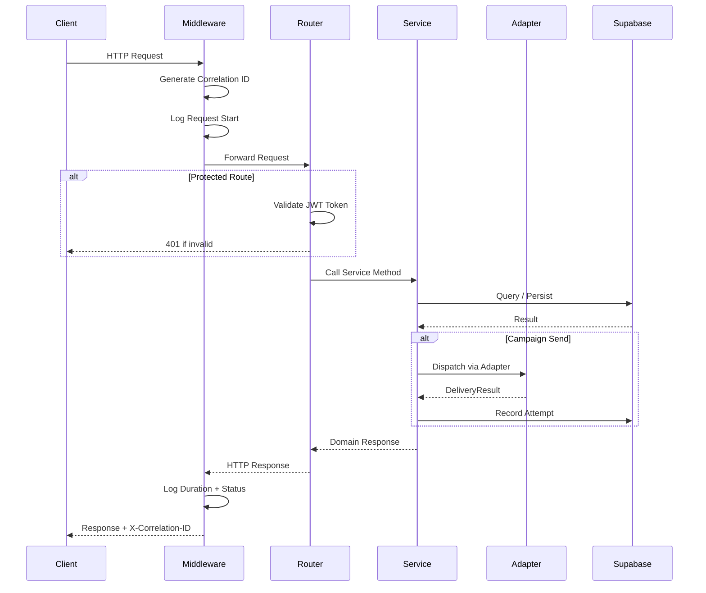
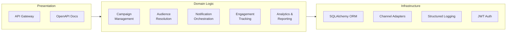
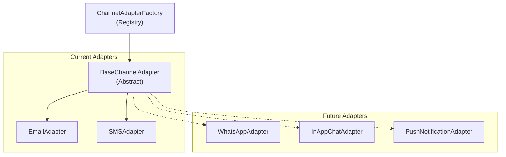
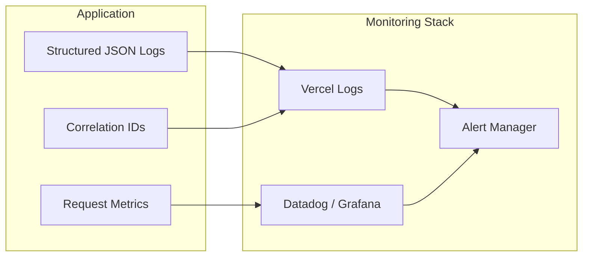

# 🏗️ Architecture Overview

## Marketing Campaign Management Portal

> A production-grade, multi-channel campaign management system designed for extensibility,
> observability, and cloud-native deployment on Vercel with Supabase.

---

## 1. System Architecture

### High-Level Component Overview

The system follows a **layered, domain-driven architecture** with clear separation of concerns, designed specifically to balance rapid POC delivery with long-term enterprise scalability. Each layer has a single responsibility and communicates through well-defined interfaces, ensuring minimal coupling.

**Major Components & Responsibilities:**
1. **API Gateway / Presentation Layer**: Receives HTTP requests, handles JWT-based authentication, validation, rate limiting, CORS, and request logging.
2. **Business Logic & Service Layer**: The core orchestrator. Manages campaign state machines, handles complex business rules, triggers audience resolution, and processes webhook events.
3. **Channel Adapter Layer (Infrastructure)**: A highly extensible registry of provider-agnostic channels (Email, SMS, future WhatsApp). Abstracted away from core domain logic.
4. **Data Access Layer**: Handles all interactions with the Supabase PostgreSQL instance via asynchronous SQLAlchemy, ensuring robust transaction boundaries.
5. **Client UI**: A responsive Next.js App Router application providing the administrative dashboard for marketing operators.

| Layer | Responsibility | Key Files |
|-------|---------------|-----------|
| **API Gateway** | Request routing, auth, CORS, logging | `api/index.py`, middleware |
| **Routes** | HTTP request/response handling | `api/routes/*.py` |
| **Services** | Business logic & orchestration | `api/services/*.py` |
| **Adapters** | Channel-specific delivery logic | `api/adapters/*.py` |
| **Models** | Data persistence & relationships | `api/models/*.py` |
| **Core** | Cross-cutting concerns | `api/core/*.py` |

### Architecture Flowchart

---

## 2. Request Lifecycle

Every API request follows this standardized lifecycle:

---

## 3. Logical vs Physical Components

### Logical Architecture

### Physical / Deployment View

| Component | Runtime | Notes |
|-----------|---------|-------|
| **FastAPI App** | Vercel Python Serverless Function | Single `api/index.py` entry point |
| **PostgreSQL** | Supabase Managed Database | Connection via `asyncpg` with pooling |
| **Static Docs** | Vercel CDN | OpenAPI/Swagger UI served at `/api/docs` |
| **Future: Redis** | Upstash (Vercel-native) | Rate limiting, caching, session store |
| **Future: Queue** | Kafka/RabbitMQ on dedicated infra | Async message processing |

---

## 4. Evolution Requirements

### 4.1 Adding WhatsApp & Chat-Based Messaging

The **Factory + Adapter pattern** makes adding new channels a 3-step process:

**Steps to add WhatsApp:**

1. **Create adapter**: `api/adapters/whatsapp_adapter.py`
   - Inherit from `BaseChannelAdapter`
   - Implement `send()` using WhatsApp Business API (Meta Cloud API)
   - Override `validate_address()` for E.164 phone format

2. **Register in factory**: Add `"whatsapp": WhatsAppAdapter` to `ChannelAdapterFactory._registry`

3. **Update enum**: Add `WHATSAPP = "whatsapp"` to `ChannelType` enum in `api/models/campaign.py`

**No changes needed** to the orchestration service, routes, or database schema.

### 4.2 Campaign Rules Evolution

Campaign rules (time windows, daily caps, throttling, DND) require a shift from synchronous to asynchronous processing:

```mermaid
flowchart TB
    subgraph Phase1["Phase 1: Current POC"]
        SYNC["Synchronous Send\n(Direct in request)"]
    end

    subgraph Phase2["Phase 2: Queue-Based"]
        API2["API Server"]
        REDIS["Redis\n• Rate Limiter\n• Daily Cap Counter\n• DND Schedule Cache"]
        QUEUE["Message Queue\n(Kafka / RabbitMQ)"]
        WORKER["Celery Workers\n• Rule Evaluation\n• Throttled Dispatch"]
        SCHED["Celery Beat\n• Time Window Scheduler\n• Campaign Scheduler"]
    end

    SYNC -.->|Evolution| API2
    API2 -->|Enqueue Messages| QUEUE
    API2 -->|Check Limits| REDIS
    QUEUE -->|Consume| WORKER
    WORKER -->|Check Rules| REDIS
    WORKER -->|Send| ADAPT2["Channel Adapters"]
    SCHED -->|Trigger| WORKER

    style Phase1 fill:#1a1a2e,stroke:#e94560
    style Phase2 fill:#0f3460,stroke:#16213e
```

**Implementation roadmap:**

| Component | Tool | Purpose |
|-----------|------|---------|
| **Rate Limiter** | Redis (Upstash) | Token-bucket per campaign, sliding window counters |
| **Message Queue** | Kafka or RabbitMQ | Decouple send requests from delivery |
| **Workers** | Celery + Redis broker | Process queue with rule evaluation |
| **Scheduler** | Celery Beat | Time-window enforcement, scheduled campaigns |
| **DND Engine** | Custom + Redis cache | Holiday/weekend/time-based suppression |

**Key data flow for rules:**
1. API receives send request → enqueue to Kafka topic `campaign.messages`
2. Celery worker consumes message → checks Redis for daily cap count
3. If under cap and within time window → dispatch via adapter
4. If cap reached or outside window → re-queue with delay
5. Increment Redis counter on successful dispatch

**State Machine Rules (Evolution):**
As the system scales, campaign pausing and stopping will evolve from manual API triggers to automated, rule-based state transitions evaluated dynamically:
- **Conditions to Pause a Campaign:**
  - *Hard Bounce Spikes*: Automatic pause if bounce rate exceeds 5% within a 15-minute window to protect sender reputation.
  - *Budget Caps*: Pause when integrated billing/cost metrics hit predefined alerting thresholds for SMS delivery.
  - *Adapter Outages*: Automatic circuit-breaker pattern; if Twilio/SendGrid report consecutive 5xx errors, pause and alert operators.
- **Conditions to Stop or Permanently Close a Campaign:**
  - *Time-to-Live (TTL) Expiry*: Campaign automatically transitions to `stopped` or `completed` after the predefined promotional end date (e.g., end of Summer Sale).
  - *Audience Exhaustion*: Queue monitors detect that all valid target identifiers have been processed and terminal states (delivered/failed) have been reached.
  - *Critical Compliance Violations*: Automatic stop if spam complaint thresholds (e.g., > 0.1%) are breached.

---

## 5. Observability Architecture

Every log entry includes:
- **Timestamp** (UTC ISO 8601)
- **Correlation ID** (UUID v4, propagated via `X-Correlation-ID` header)
- **Request context** (method, path, status code, duration)
- **Structured JSON** for machine parsing

---

## 6. Security Considerations

| Concern | POC Implementation | Production Recommendation |
|---------|-------------------|--------------------------|
| **Authentication** | Mock JWT with static users | Supabase Auth / Auth0 OIDC |
| **API Keys** | Plaintext in config | AWS KMS / Vault encryption |
| **Rate Limiting** | None | Redis-backed per-IP/per-user limits |
| **Input Validation** | Pydantic schemas | + WAF rules, SQL injection protection |
| **Webhook Auth** | Open endpoint | HMAC signature verification |
| **CORS** | Configurable origins | Strict production allowlist |
