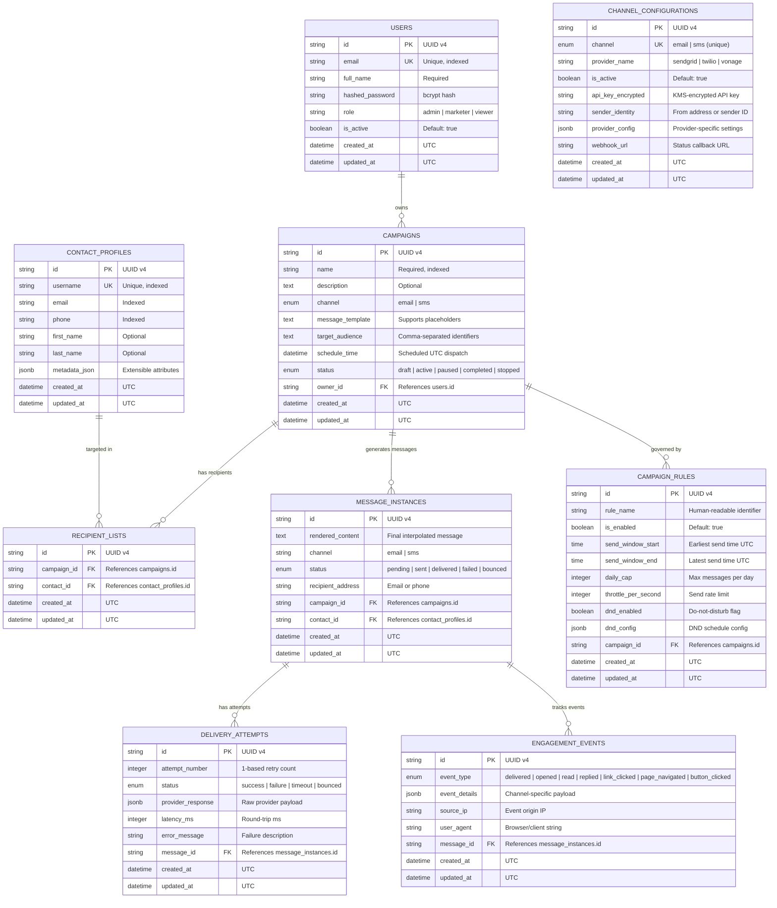
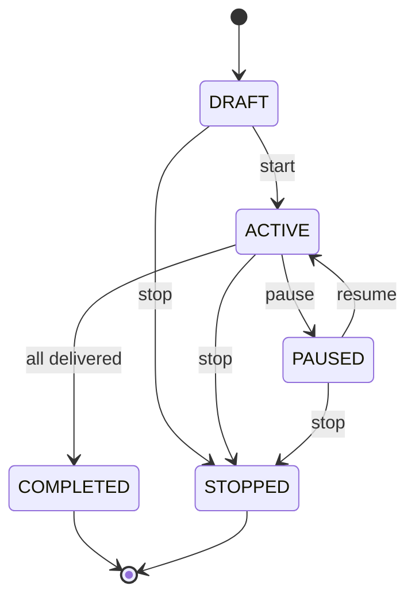

# 📊 Data Model Documentation

## Marketing Campaign Management Portal

> Complete entity reference and Entity-Relationship Diagram for the
> campaign management data layer backed by Supabase (PostgreSQL).

---

## Entity-Relationship Diagram

---

## Entity Descriptions

### 1. Users
**Purpose:** Represents portal operators who create and manage campaigns.

| Field | Type | Constraints | Description |
|-------|------|-------------|-------------|
| `id` | UUID | PK | Unique identifier |
| `email` | VARCHAR(255) | Unique, Not Null | Login credential |
| `full_name` | VARCHAR(255) | Not Null | Display name |
| `hashed_password` | VARCHAR(512) | Not Null | bcrypt hash |
| `role` | VARCHAR(50) | Not Null | `admin`, `marketer`, or `viewer` |
| `is_active` | BOOLEAN | Default: true | Account status |

**Relationships:** One user → many campaigns (owner)

---

### 2. Contact Profiles
**Purpose:** Target audience members with multi-channel contact information.

| Field | Type | Constraints | Description |
|-------|------|-------------|-------------|
| `id` | UUID | PK | Unique identifier |
| `username` | VARCHAR(100) | Unique | Resolvable handle |
| `email` | VARCHAR(255) | Indexed | Email address |
| `phone` | VARCHAR(20) | Indexed | Phone number (E.164) |
| `first_name` | VARCHAR(100) | Optional | For template personalization |
| `last_name` | VARCHAR(100) | Optional | For template personalization |
| `metadata_json` | JSONB | Optional | Extensible attributes (preferences, tags, segments) |

**Relationships:** One contact → many recipient list entries

---

### 3. Campaigns
**Purpose:** Central aggregate representing a marketing campaign with lifecycle management.

| Field | Type | Constraints | Description |
|-------|------|-------------|-------------|
| `id` | UUID | PK | Unique identifier |
| `name` | VARCHAR(255) | Not Null, Indexed | Campaign name |
| `description` | TEXT | Optional | Detailed description |
| `channel` | ENUM | Not Null | `email` or `sms` |
| `message_template` | TEXT | Not Null | Template with `{{placeholders}}` |
| `target_audience` | TEXT | Optional | Comma-separated identifiers |
| `schedule_time` | TIMESTAMPTZ | Optional | Scheduled send time |
| `status` | ENUM | Not Null | Lifecycle state (see below) |
| `owner_id` | UUID | FK → users | Campaign creator |

**Campaign Status State Machine:**

---

### 4. Recipient Lists
**Purpose:** Junction table linking campaigns to target contacts.

| Field | Type | Constraints | Description |
|-------|------|-------------|-------------|
| `id` | UUID | PK | Unique identifier |
| `campaign_id` | UUID | FK → campaigns | Parent campaign |
| `contact_id` | UUID | FK → contact_profiles | Targeted contact |

---

### 5. Message Instances
**Purpose:** Individual rendered messages per recipient. Tracks delivery status.

| Field | Type | Constraints | Description |
|-------|------|-------------|-------------|
| `id` | UUID | PK | Unique identifier |
| `rendered_content` | TEXT | Not Null | Final interpolated message |
| `channel` | VARCHAR(20) | Not Null | Delivery channel used |
| `status` | ENUM | Not Null | `pending`, `sent`, `delivered`, `failed`, `bounced` |
| `recipient_address` | VARCHAR(255) | Not Null | Resolved email or phone |
| `campaign_id` | UUID | FK → campaigns | Parent campaign |
| `contact_id` | UUID | FK → contact_profiles | Target contact |

---

### 6. Delivery Attempts
**Purpose:** Records each attempt to send a message, supporting retry analytics.

| Field | Type | Constraints | Description |
|-------|------|-------------|-------------|
| `id` | UUID | PK | Unique identifier |
| `attempt_number` | INTEGER | Not Null | 1-based retry counter |
| `status` | ENUM | Not Null | `success`, `failure`, `timeout`, `bounced` |
| `provider_response` | JSONB | Optional | Raw provider API response |
| `latency_ms` | INTEGER | Optional | Round-trip latency |
| `error_message` | VARCHAR(1024) | Optional | Human-readable error |
| `message_id` | UUID | FK → message_instances | Parent message |

---

### 7. Engagement Events
**Purpose:** Tracks recipient interactions for analytics and reporting.

| Field | Type | Constraints | Description |
|-------|------|-------------|-------------|
| `id` | UUID | PK | Unique identifier |
| `event_type` | ENUM | Not Null | See supported types below |
| `event_details` | JSONB | Optional | Channel-specific payload |
| `source_ip` | VARCHAR(45) | Optional | Event origin IP |
| `user_agent` | VARCHAR(512) | Optional | Client user agent |
| `message_id` | UUID | FK → message_instances | Associated message |

**Supported Event Types:**
| Event | Description | Example `event_details` |
|-------|-------------|------------------------|
| `delivered` | Message confirmed delivered | `{"provider": "sendgrid", "smtp_response": "250 OK"}` |
| `opened` | Recipient opened/viewed message | `{"device": "mobile", "os": "iOS 17"}` |
| `read` | Message marked as read | `{"read_duration_ms": 4500}` |
| `replied` | Recipient replied to message | `{"reply_snippet": "Thanks for..."}` |
| `link_clicked` | Recipient clicked a link | `{"link_url": "https://promo.example.com", "position": 2}` |
| `page_navigated` | Recipient navigated to a page | `{"page_url": "/products", "referrer": "/email-link"}` |
| `button_clicked` | Recipient clicked a CTA button | `{"button_label": "Buy Now", "page": "/checkout"}` |

---

### 8. Campaign Rules
**Purpose:** Configurable execution rules for controlling send behavior.

| Field | Type | Constraints | Description |
|-------|------|-------------|-------------|
| `id` | UUID | PK | Unique identifier |
| `rule_name` | VARCHAR(100) | Not Null | e.g., `business_hours_only` |
| `is_enabled` | BOOLEAN | Default: true | Rule active flag |
| `send_window_start` | TIME | Optional | Earliest send time (UTC) |
| `send_window_end` | TIME | Optional | Latest send time (UTC) |
| `daily_cap` | INTEGER | Optional | Max messages per day |
| `throttle_per_second` | INTEGER | Optional | Send rate limit |
| `dnd_enabled` | BOOLEAN | Default: false | Do-not-disturb flag |
| `dnd_config` | JSONB | Optional | `{"days": ["sat","sun"], "holidays": [...]}` |
| `campaign_id` | UUID | FK → campaigns | Parent campaign |

---

### 9. Channel Configurations
**Purpose:** Stores provider credentials and settings per delivery channel.

| Field | Type | Constraints | Description |
|-------|------|-------------|-------------|
| `id` | UUID | PK | Unique identifier |
| `channel` | ENUM | Unique | `email` or `sms` |
| `provider_name` | VARCHAR(100) | Not Null | `sendgrid`, `twilio`, etc. |
| `is_active` | BOOLEAN | Default: true | Channel active flag |
| `api_key_encrypted` | VARCHAR(1024) | Optional | Encrypted API key |
| `sender_identity` | VARCHAR(255) | Optional | From address / sender ID |
| `provider_config` | JSONB | Optional | Provider-specific settings |
| `webhook_url` | VARCHAR(512) | Optional | Status callback URL |

---

## Indexing Strategy

| Table | Indexed Columns | Index Type | Rationale |
|-------|----------------|------------|-----------|
| `users` | `email` | Unique B-tree | Login lookups |
| `contact_profiles` | `username`, `email`, `phone` | B-tree | Audience resolution |
| `campaigns` | `name`, `owner_id` | B-tree | Listing/filtering |
| `recipient_lists` | `campaign_id`, `contact_id` | B-tree | Join performance |
| `message_instances` | `campaign_id` | B-tree | Reporting queries |
| `delivery_attempts` | `message_id` | B-tree | Status lookups |
| `engagement_events` | `message_id`, `event_type` | B-tree | Analytics aggregation |
| `campaign_rules` | `campaign_id` | B-tree | Rule evaluation |
| `channel_configurations` | `channel` | Unique B-tree | Config lookups |
